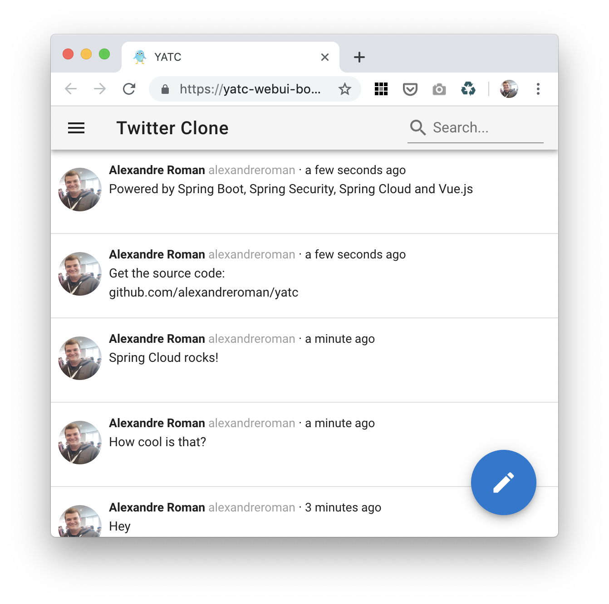

# Yet Another Twitter Clone (YATC)

This project shows how to create a cloud-native app made of microservices
using Spring Boot, Spring Security and Spring Cloud. Frontend UI is using
Vue.js and Vuetify.



This app is leveraging several cloud-native patterns:
 - **Microservices everywhere**: deploy this app with zero downtime, easily scale
 parts of this app depending on CPU load and available resources
 - **API first**: the frontend is calling backend services using REST API calls
 - **API gateway**: all backend services are exposed using Spring Cloud Gateway,
 which allows you to change your implementation without breaking your public API
 (a single public endpoint is required for all of your backend services)
 - **Service discovery**: all microservices are using Netflix Eureka to locate
 API endpoints, no matter how many instances you create
 - **Client-side load balancing**: all API calls are automatically distributed among
 running instances, without relying on a common platform load balancer
 (less latency when making network calls)
 - **Event-driven architecture**: microservices are connected to each other using a
 message broker, which brings more flexibility and promotes loose coupling between
 components
 - **Caching**: get better network performance with little effort using built-in HTTP client
 caching support
 - **External configuration**: share the same binaries between development and production
 environments by externalizing configuration

## Compiling this project

Build this app using a JDK 8+:
```bash
$ ./build.sh
```

## Running locally

You can run this app on your workstation.

Start a RabbitMQ instance:
```bash
$ docker run --rm --name rabbitmq -p 15672:15672/tcp -p 5672:5672/tcp rabbitmq:3-management
```

Start a Redis instance:
```bash
$ docker run --rm --name redis -p 6379:6379/tcp redis:5
```

Start a Netflix Eureka instance:
```bash
$ java -jar yatc-eureka/target/yatc-eureka.jar
```

Start all microservices (start order does not matter):
```bash
$ java -jar yatc-connections/target/yatc-connections.jar
$ java -jar yatc-feeds/target/yatc-feeds.jar
$ java -jar yatc-gateway/target/yatc-gateway.jar
$ java -jar yatc-posts/target/yatc-posts.jar
$ java -jar yatc-search/target/yatc-search.jar
$ java -jar yatc-users/target/yatc-users.jar
$ java -jar yatc-webui/target/yatc-webui.jar
```

This app should be available at http://localhost:8080.

You'll need to authenticate using your GitHub profile.

## Deploying to Cloud Foundry

First you need to create some services.

If you're using [Pivotal Web Services](https://run.pivotal.io), run this script:
```bash
$ ./create-services-pws.sh
```

If you're using your own [Pivotal Cloud Foundry](https://pivotal.io/platform) instance,
run this script:
```bash
$ ./create-services-pcf.sh
```

Just run `cf push` to deploy this app:
```bash
$ cf push
```

## Contribute

Contributions are always welcome!

Feel free to open issues & send PR.

## License

Copyright &copy; 2019 [Pivotal Software, Inc](https://pivotal.io).

This project is licensed under the [Apache Software License version 2.0](https://www.apache.org/licenses/LICENSE-2.0).
